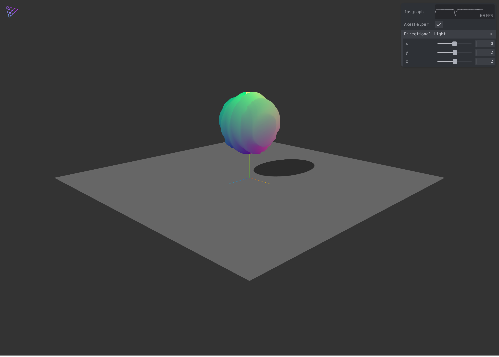

# Modern ThreeJS ⚡️

> Modern ThreeJS boilerplate powered by Vite & Typescript.



## Features

- Powered with [Vite](https://vite.dev/) 📦
- GUI controls using [Tweakpane](https://cocopon.github.io/tweakpane/) 🎛
- Typescript 🦾
- No classes, just functions 🎯
- Shader support (glsl) with[vite-plugin-glsl](https://github.com/UstymUkhman/vite-plugin-glsl) 🎨

### Project setup

### Use it

```
pnpm dev
```

This will serve the app at [http://localhost:3000](http://localhost:3000)

### Build it

```
pnpm build
```

Builds the app for production to the `dist` folder.<br>

The build is minified and the filenames include the hashes.<br>
Your app is ready to be deployed!